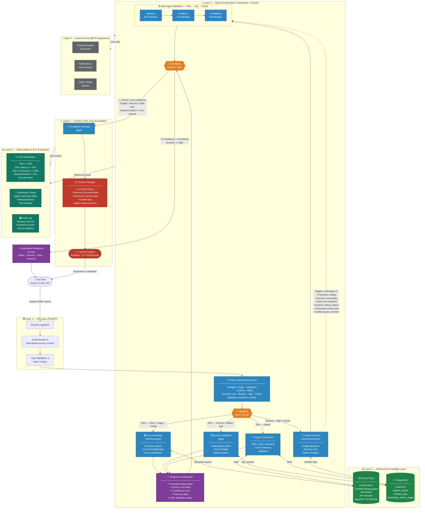

# High-Level Flow Architecture Diagram
# Enterprise Software Support & Resolution Intelligence System



---

## System Layer Summary

| # | Layer | Technology | Role |
|---|---|---|---|
| 1 | **API** | FastAPI | Auth, RBAC, rate limiting, input validation |
| 2 | **Orchestration** | LangGraph / CrewAI | 5 agents + router + Plan→Act→Check loop |
| 3 | **Knowledge** | pgvector + PostgreSQL | RAG retrieval + structured SQL queries |
| 4 | **External Tools** | MCP Integrations | Ticketing, CRM, notification connectors |
| 5 | **Escalation** | Human-in-the-Loop | Escalation Manager → full context handoff |
| 6 | **Observability** | Langfuse | SLO tracking, traces, audit logs |

---

## Query Routing Logic

```
Incoming query
│
├── 55% — Usage / Config / Docs     → Documentation Retrieval Agent  → Vector Store (RAG)
├── 30% — Account / Billing / Sub   → Account Validation Agent       → PostgreSQL (SQL)
├── 15% — Hybrid signals            → Hybrid Coordinator             → RAG + SQL
└── Severity = High / Critical      → Incident Severity Assessment   → Multi-Agent Validation
```

---

## PostgreSQL Tables

| Table | Used By |
|---|---|
| `customers` | Account Validation Agent |
| `support_tickets` | Intent Classifier, Escalation Manager |
| `incident_logs` | Incident Severity Agent, Multi-Agent Validation |
| `knowledge_article_usage` | Documentation Retrieval Agent, Observability |

---

## Escalation Trigger Conditions

| Trigger | Action |
|---|---|
| Severity = Critical | Force multi-agent validation → escalate |
| Confidence score < threshold | Escalate with context package |
| Production outage detected | Immediate escalation |
| Security vulnerability found | Immediate escalation |
| Data loss complaint, no logs | Escalate |
| Multiple tickets = systemic failure | Escalate |
| User explicitly requests human | Escalate |

---

## SLO Targets

| Metric | Target |
|---|---|
| Task Success Rate (TSR) | >= 90% |
| P95 Response Latency | <= 3–6 seconds |
| SQL Query Correctness | >= 95% |
| Critical Misclassification Rate | < 3% |
| Cost per Ticket | Within defined budget |
